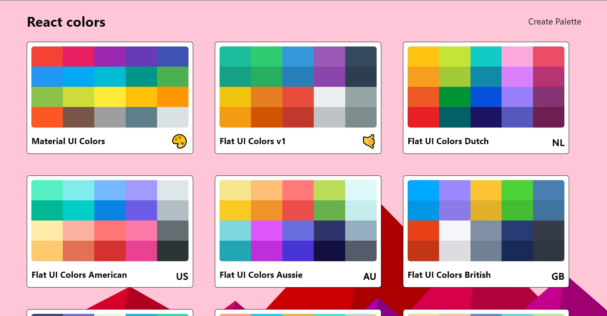
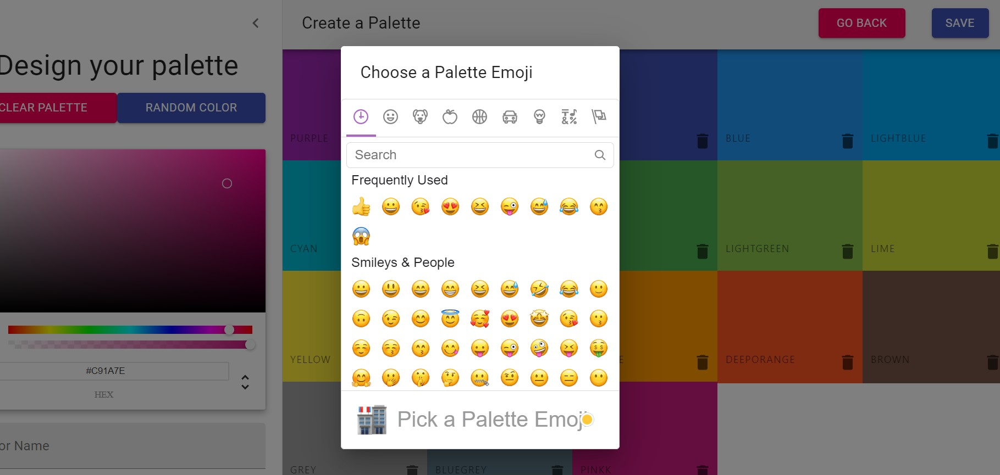
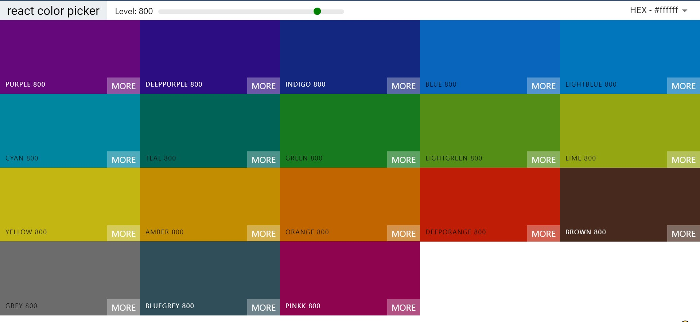

## Color Palette Generator

<b>Built with</b> 

<em>Completed as part of the Udemy course ‘The Modern React Bootcamp’ by Colt Steele.</em>

- A responsive frontend application that allows users to create their color palettes by adding and deleting different colors.
- Utilizes various React libraries such as Material UI, React Transition Group, etc. Users can easily and
intuitively create customized color schemes for their projects.

<h2><a href="https://anushkabahuguna.github.io/react-colors-app/">Demo</a></h2>

